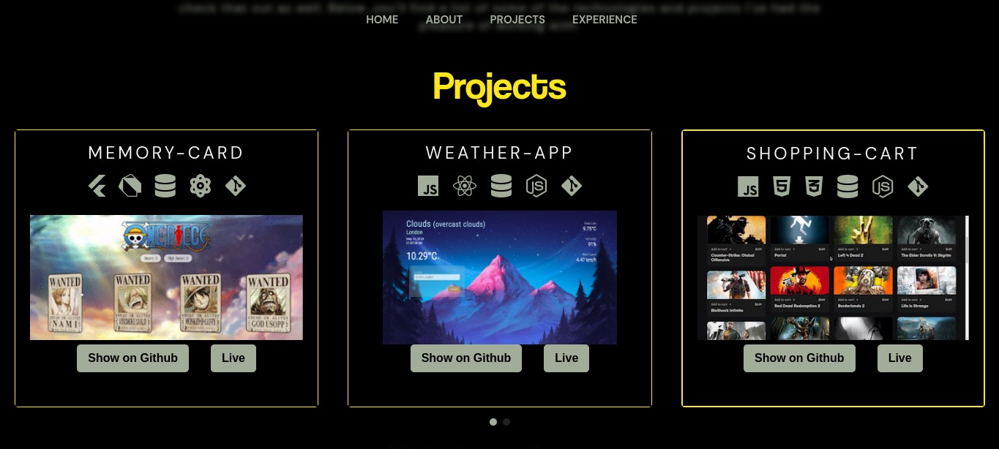
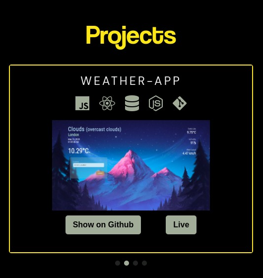

	<h1>Portfolio
	 
		
		
		 
	</h1>
	<h3><b><a href="https://enriquehoebeb.netlify.app/">View Live Demo</a></b></h3>

## Description

My personal portfolio site.

## Built Using

- React 
- Javascript 
- Prettier 

## Credits

#### Libraries

- [Framer Motion](https://www.framer.com/motion/)

#### Icons

- [React Icons](https://github.com/react-icons/react-icons)
- [Google Material Icons](https://fonts.google.com/icons)
- [Simple Icons](https://simpleicons.org/)

#### Other

- [FranksLaboratory - Canvas Particle Effect](https://www.youtube.com/@Frankslaboratory/)

## Gallery

#### Desktop

#### Mobile

